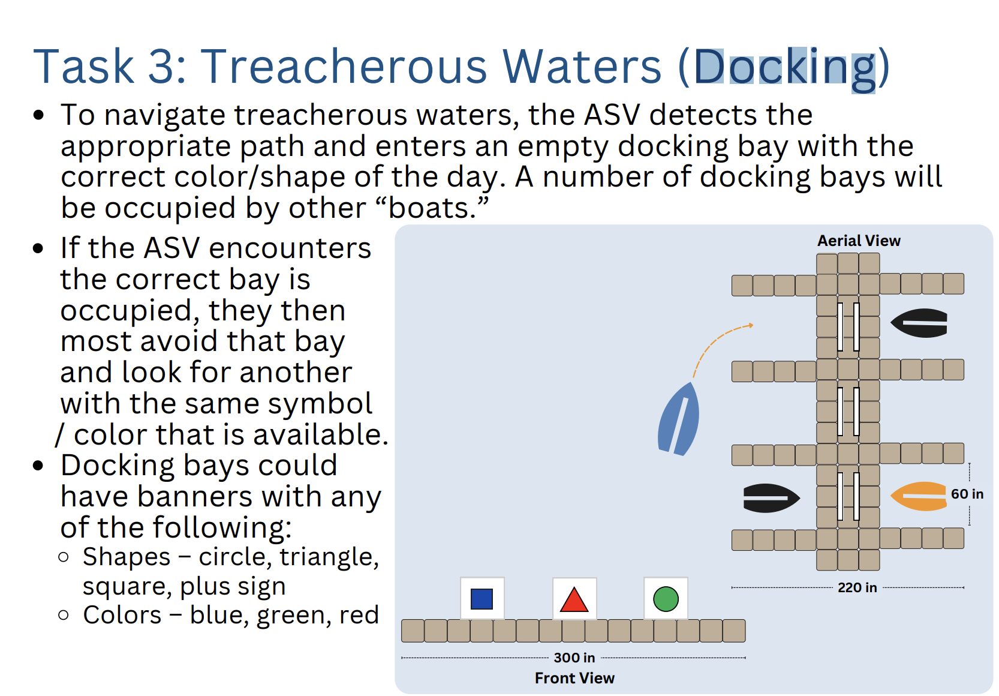
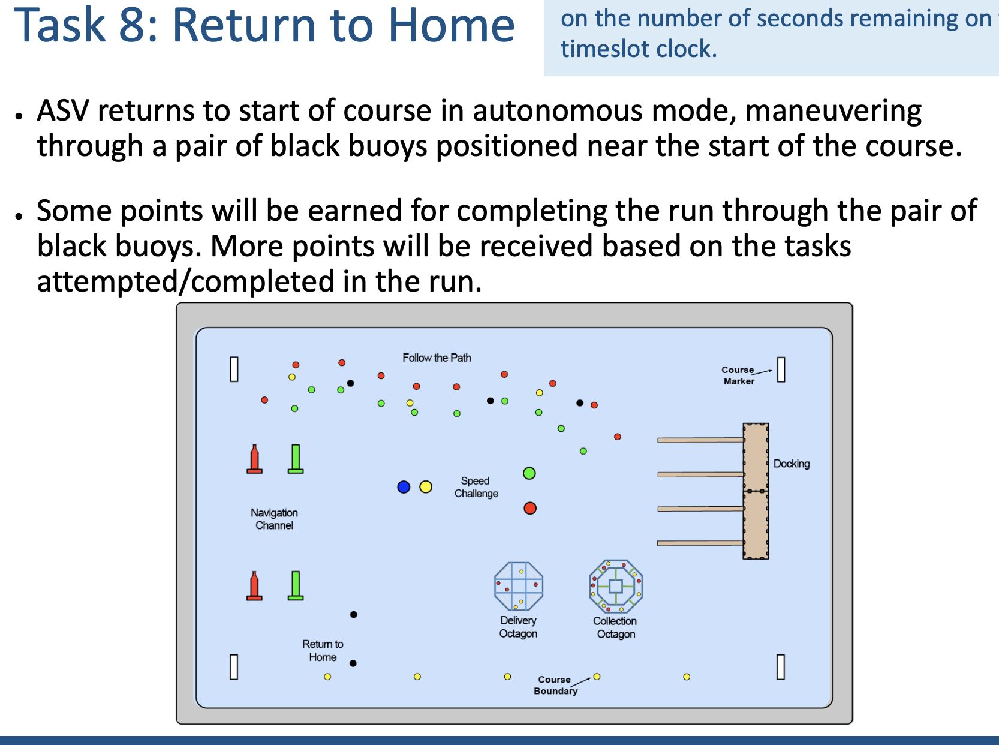

# 04 · Autonomous Systems & Robotics — Cornell AutoBoat

My work as an **AI Developer on Cornell's AutoBoat team**. This is where I sharpened systems thinking, deep technical collaboration, and working inside a large shared codebase — all skills I'm carrying into ML engineering in healthcare.

> Repo is Cornell-student access only.

## What I Worked On

- **Obstacle avoidance & navigation** — Collaboratively enabled the autonomous boat to avoid buoy obstacles and traverse to an end-goal located between two buoys near the competition entrance, using path-planning and pure-pursuit execution algorithms.
- **ROS integration** — Incorporated the ROS framework into the team's codebase for modular, message-based communication across nodes.
- **Debugging & validation** — Debugged software methods through unit testing and visualization, fixing functionality so the boat could correctly filter objects detected within range and correct waypoints for proper navigation to the end-goal.

## Tasks

**Docking Task**

**Return to Home Task**

## Why This Matters for Healthcare ML

Autonomous robotics and clinical ML share more than they look like they do: both demand rigorous systems thinking, safety-critical debugging, and tight collaboration across specialists (hardware, perception, planning — or clinicians, data scientists, engineers). AutoBoat gave me the closest analog I've had to the kind of multidisciplinary engineering healthcare ML demands.
