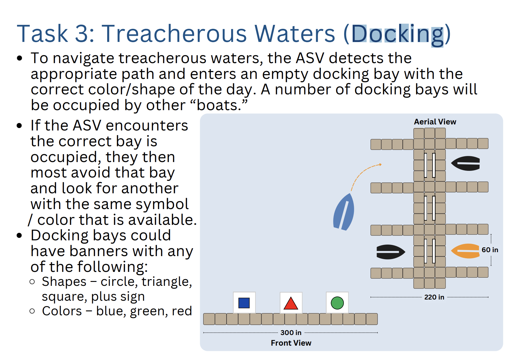
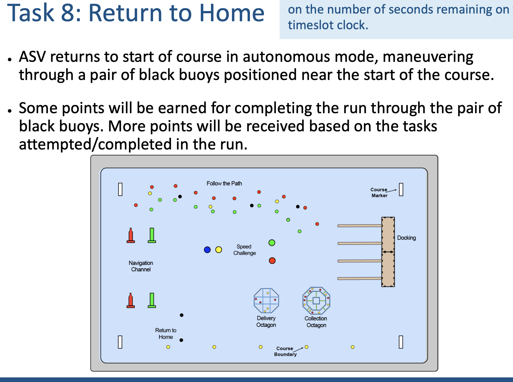

Repo for Autoboat is Cornell student access only:
Description of my work:
Collaboratively allowed autonomous boat to avoid buoy obstacles and traverse to end-goal located between two buoys near competition entrance, adopting path-planning and pure pursuit execution algorithms, as well as incorporating ROS framework into codebase 
Debugged methods in software codebase via unit-testing and visualization, fixing functionality for boat to correctly filter objects detected within range and correcting waypoints for proper navigation to end-goal

Docking Task:

Return to Home Task:
